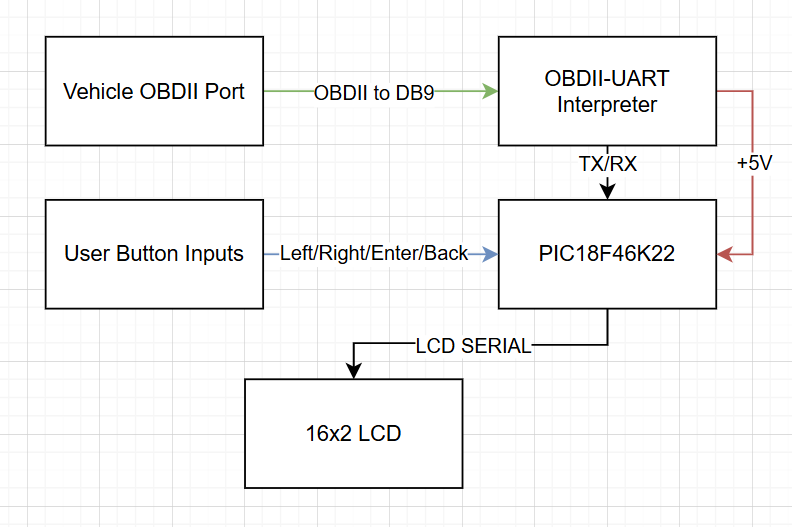

# ECE 3301 Final Project: OBDII Scanner using the PIC18F46K22 #
### By Luca Lanzillotta and Zihong Zheng ###
*Abstract:*
* [*Link to original Cornell Project*](https://people.ece.cornell.edu/land/courses/ece4760/FinalProjects/s2012/ppv5/index.html)
* Create an OBD II scanner that is compatible with any ISO OBD II standard to read basic vehicle telemetry and diagnostics. The design will utilize a Sparkfun OBD II to UART intpreter board and will utilize half duplex capabilities to send requests from the PIC18F46K22 and receive data to display on an LCD. Additionally the board will include buttons to navigate a menu to send and receive specific requests such as RPM, Oil Pressure, Cylinder Diagnostics, and will have a dedicated mode to display live data on the display. 

### Assignment Requirements: ###
* Use serial communication -> UART
* Use CCP register -> Using in compare mode
* Use TMR register -> Using as a value to compare to
* Use Interrupts -> Using an ISR to read UART

### Components: ###
* Microcontroller: 
    * PIC18F46K22 and curiosity board (might not use if we design a PCB)
* OBC II to UART: 
    * Sparkfun OBD-II to UART board
* Display: 
    * Generic Microcontroller compatible LCD
* Buttons: 
    * 4/5 buttons in a d-pad style arrangement to emulate a controller d-pad
* Casing: 
    * 3D printed encasing to hold all the components together
* PCB: 
    * Potential to design and manufacture a little PCB that holds the pic together with its necessary connectors to communicate to the board.

# Design Description: #
## System Block Diagram: ##

## System State Diagram: ## 

.png>)

## System Schematic: ##

## Startup Sequence: ##

### Welcome Screen ###
* The welcome screen is not only a splash screen for the user to observe, but also provides as an error checking mechanism for the proper connection to your vehicles OBDII port. The splash screen itself has a countdown timer that is setup with the CCP register of the PIC.
When the splash screen is displayed it checks if the OBDII protocol is detected, in the case it is not, it notifies the user and stalls at the welcome screen until the user plugs in the device. When the user plugs in the device in this state, it initiates a timer and displays a connected message. Below are the cases of which occur when the user starts the PIC with an OBDII device connected, without an OBDII device connected, and what occurs when the user plugs in after the PIC detects no device is connected.

Note: C is the counter for the countdown
Welcome Splash Modes:
* OBDII is plugged in:

        <<< OBDIIPIC >>>
        <<<< V1.0 >>>> C

* OBDII is not plugged in:
   
        <<< OBDIIPIC >>>
        OBDII Not Found 

* OBDII is not plugged in, then connected:

        OBDII Detected
        ==============

* Code block:

        void welcome_splash(void) {
        volatile int plug_flag = 0; // 0 = disconnected, 1 = connected
        volatile unsigned int CCP1IF_counter = 0; // timer counter

        // Splash Screen when the OBDIIPIC turns on
        LCD_clear();
        LCD_cursor_set(1, 1);   
        LCD_write_string(">>> OBDIIPIC <<<");
        LCD_cursor_set(2, 1);
        LCD_write_string(">>>> V1.0 <<<<");

        ccp1_init(); // Setup CCP1 module
        tmr1_init(); // Start Timer1

        CCP1IF_counter = 0;
        plug_flag = 0;

        while (1) { // stay here until successful 5 seconds of connection
            if (PIR1bits.CCP1IF) { // every 0.1 seconds
                PIR1bits.CCP1IF = 0; 
                T1CONbits.TMR1ON = 1; // Restart timer
                CCP1IF_counter++;

                LCD_cursor_set(2, 16);
                LCD_write_variable((CCP1IF_counter) / 10, 1);

                // Every second (10 ticks of 0.1s) send an ATI ping
                if (CCP1IF_counter % 10 == 0) {
                    UART1_SendString("ATI\r");
                }
            }

            // Check if message was received
            if (message_complete) {
                plug_flag = 1; // Connected
                buffer_count = 0;
                message_complete = 0;
            }

            // If connected, continue counting
            if (plug_flag) {
                if (CCP1IF_counter >= splash_delay * 10) { 
                    // Connected continuously for n seconds
                    break; // Exit splash
                }
            } else {
                // No connection or lost connection — reset timer
                CCP1IF_counter = 0;
                LCD_cursor_set(2, 1);
                LCD_write_string("OBDII Not Found ");
                UART1_SendString("ATI\r"); // keep pinging to find ELM327
                __delay_ms(short_delay_preset);
            }
        }

        // ELM detected after successful 5 seconds
        LCD_clear();
        LCD_cursor_set(1, 1);
        LCD_write_string("<OBDII Detected>");
        LCD_cursor_set(2,1);
        LCD_write_string("================");
        __delay_ms(2 * long_delay_preset);

        UART1_SendString("ATE0\r"); // Disable Echo
        __delay_ms(short_delay_preset);
        }  

## Standard Operation Mode: ##

* The OBDII_PIC is a user friendly device, because of this it was important to include essential buttons to the functionality of any configurable embedded device, it was for this reason that the OBDIIPIC includes a main menu and intuitive tools to navigate it using with a scroll wheel and enter and back buttons. The scroll wheel is a simple potentiometer configured using the PIC's ADC, which displays a flashing cursor relative to its rotational position. The menu includes four modes that any OBDII device should have, the first is the Live Reading mode, written LR to conserve LCD space, this mode displays the current Engine RPM, Battery Voltage, and Air Intake Temperature. The mode also includes a parsing icon which notifies the user that information is being requested and displayed. The second mode is by far the most useful and challenging to program, as it interacts directly with the vehicles ECU when requesting OBDII PIDs. The second mode is the Diagnostic Trouble Codes, DTC for short. This mode allows the user to request OBDII PIDs using the 03 PID request that is standardized for OBDII. Upon requesting the diagnostic codes, the PIC recieves two bytes of data per code and displays them on the LCD. In the case where there are more than three diagnostic codes, the PIC must detect a shift in transmission protocol and adjust the reception of the data to be legible. Additionally, if there is more data than the LCD can display, the user can scroll through the diagnostic codes utilizing the embedded potentiometer. Next up is the third and most powerful mode; the Clear Diagnostic Codes, or CDC for short allows the user to clear any error codes generated from the ECU of the vehicle, this of course may be overwritten the time the vehicle starts, or if an error code is generated during normal operation. The mode allows for a Y/N style menu and returns to the main menu after either option is selected, which before returning indicates the request was either allowed or cancelled to confirm the users decision. Lastly is the Display System Information mode, or DSI for short. This mode tells the user which ELM protocol the OBDII to UART IC is using, in this case the current firmware version is 1.4b, and also notifies the user which SAE version the vehicle being used uses.
Due to the ease of use, if the user wishes to exit any mode at any instant, the back button provides itself as function to reset the PIC to the main menu to select another mode.
        
### Main Menu: ###

        MENU  <OBDIIPIC>
        LRM RDC CDC DSI
    
Code chunk:

        void main_menu(void){ //main menu loop, checks back and enter state and takes in mode set by potentiometer input
            
        LCD_clear();
        display_mm(); //main menu display function
        
        while(1){
            display_mm();
            result = readADC();
            if(result >= 0 && result <= 255){ //set first value range
                menu_sel = 0;
                LCD_cursor_set(2,1);
            
            }
            if(result >= 256 && result <=511){ //set second value range
                menu_sel = 1;
                LCD_cursor_set(2,5);
            
            }
            if(result >=512 && result <=767){ //set third value range
                menu_sel = 2;
                LCD_cursor_set(2,9);
            }
            if(result >= 768 && result <=1023 ){ //set fourth value range
                menu_sel = 3;
                LCD_cursor_set(2,13); 
            }
            LCD_configure_cursor_blink(1);

            if (PORTBbits.RB4 == 0) { // Enter button pressed (Assuming active low button)
                __delay_ms(20); // Simple debounce
                if (PORTBbits.RB4 == 0) { // Confirm still pressed
                    LCD_configure_cursor_blink(0);
                    LCD_clear();

                    // Now go into the selected mode
                    switch (menu_sel) {
                        case 0:
                            while (1) {
                                live_reading_mode();
                                // Check for back button
                                if (PORTCbits.RC5 == 0) {
                                    __delay_ms(20);
                                    if (PORTCbits.RC5 == 0) {
                                        LCD_clear();
                                        display_mm(); // Go back to main menu display
                                        menu_sel = -1; // reset mode
                                        break; // break out of inner while(1)
                                    }
                                }
                            }
                            break;

                        case 1:
                            while (1) {
                                // Read Diagnostic Codes logic here

                                // Check for back button
                                if (PORTCbits.RC5 == 0) {
                                        __delay_ms(20); //button debounce
                                    if (PORTCbits.RC5 == 0) {
                                        LCD_clear();
                                        display_mm(); 
                                        menu_sel = -1; //reset the mode
                                        break; //break out of inner while(1)
                                    }
                                }
                            }
                            break;

                        case 2:
                            while (1) {
                                    __delay_ms(200); //debounce the button press
                                    clear_diagnostic_codes(); //run the mode
                                    menu_sel = -1;
                                    break; //once its done exit the while loop and shoot you back to the menu
                                if (PORTCbits.RC5 == 0) {
                                    __delay_ms(20);
                                    if (PORTCbits.RC5 == 0) {
                                        LCD_clear();
                                        display_mm();
                                        menu_sel = -1;
                                        break;
                                    }
                                }
                            }
                            break;

                        case 3:
                            while (1) {
                                display_system_info(); // DSI mode
                                //stay here unless back button is pressed
                                if (PORTCbits.RC5 == 0) {
                                __delay_ms(20);
                                    if (PORTCbits.RC5 == 0) {
                                        LCD_clear();
                                        display_mm();
                                        menu_sel = -1;
                                        break;
                                    }
                                }
                            }
                            break;

                        default:
                            break;
                    }
                }
            }

            __delay_ms(50); // Small delay for stability
        }
    }

### Live Reading mode: ###
* Display RPM, Battery Voltage, and Air Intake Temperature
        
        RPM  VBatt AIT    
        0000 0.0V    C

Code chunk:

        unsigned char hex_char_to_value(char c) {  // Hex char to value handler function
        if (c >= '0' && c <= '9') return c - '0'; //if the character is between 0 and 9, (ASCII codes 48-57) subtract 0 to get its actual value
        if (c >= 'A' && c <= 'F') return c - 'A' + 10; //if the character is between A and F (ASCII codes 65-70) subtract A (which is 10 in hex) and add 10
        if (c >= 'a' && c <= 'f') return c - 'a' + 10; //if the character is between a and f (ASCII codes 97-102) subtract a and add 10
        return 0; // Error case if nothing matches in these places, return an error value of zero
    }

    void print_RPM(void){ // Request and display RPM OBDII PID

        UART1_SendString("010C\r");
        while(!message_complete) {
            // Wait here until full reply received
            if (PORTCbits.RC5 == 0) { //back function
                __delay_ms(20);
                if (PORTCbits.RC5 == 0) {
                    LCD_clear();
                    display_mm(); // Go back to main menu display
                    menu_sel = -1; // reset mode
                    break; // break out of inner while(1)
                }
            }
            parsing_notif();
        }
        clear_parsing_notif();

        A_rpm = (hex_char_to_value(buffer[4]) << 4) | hex_char_to_value(buffer[5]); //shift the 4th index value over 4 bits and or it with the 5th to make the full byte
        B_rpm = (hex_char_to_value(buffer[6]) << 4) | hex_char_to_value(buffer[7]); //shift the 6th index value over 4 bits and or it with the 7th to make the 2nd full bye
        RPM = ((A_rpm * 256) + B_rpm) / 4; //Do the math to find RPM speed
        
        sprintf(rpm_string, "%u", RPM); // Turn RPM number we grabbed from converted hex values into a string

        LCD_cursor_set(2,1);
        LCD_write_string("     "); //clear the data entry

        LCD_cursor_set(1,1);
        LCD_write_string("RPM");
        LCD_cursor_set(2,1);
        LCD_write_string(rpm_string);

        buffer_count = 0;     // Clear buffer for next message
        message_complete = 0; // Ready for next
    }

    void print_Vbatt(void) { // Request and display VBatt AT Command

        UART1_SendString("ATRV\r"); // Request Battery Voltage using AT command
        while(!message_complete) {
            // Wait here until full reply received
            if (PORTCbits.RC5 == 0) { //back function
                __delay_ms(20);
                if (PORTCbits.RC5 == 0) {
                    LCD_clear();
                    display_mm(); // Go back to main menu display
                    menu_sel = -1; // reset mode
                    break; // break out of inner while(1)
                }
            }
            parsing_notif();
        }
        clear_parsing_notif();

        LCD_cursor_set(2,7);
        LCD_write_string("     "); //clear the data entry
        
        LCD_cursor_set(1,7);
        LCD_write_string("VBatt");
        LCD_cursor_set(2,7);

        if (!strchr(buffer, 'V')) { //Since the voltage reading always containts a V, we can use this to check if we are getting SEARCHING... or actual voltage
            LCD_write_string("N/A"); //So if we dont have a V in the incoming buffer, print this
        }
        else {
        LCD_write_string(buffer); //If we do have a V, 
        }

        buffer_count = 0;     // Clear buffer for next message
        message_complete = 0; // Ready for next
    }

    void print_AI_Temp(void){ //Request and display Air Intake Temp PID

        UART1_SendString("010F\r");
        while(!message_complete) {
            if (PORTCbits.RC5 == 0) { //back function
                __delay_ms(20);
                if (PORTCbits.RC5 == 0) {
                    LCD_clear();
                    display_mm(); // Go back to main menu display
                    menu_sel = -1; // reset mode
                    break; // break out of inner while(1)
                }
            }
            // Wait here until full reply received
            parsing_notif();
        }
        clear_parsing_notif();

        LCD_cursor_set(2,13);
        LCD_write_string("   "); //clear the data entry

        A_air_intake = (hex_char_to_value(buffer[4]) << 4) | hex_char_to_value(buffer[5]);
        air_intake_temp = A_air_intake - 40;
        
        sprintf(air_intake_string, "%u", air_intake_temp); // Turn RPM number we grabbed from converted hex values into a string

        LCD_cursor_set(1,13);
        LCD_write_string("AIT");
        LCD_cursor_set(2,13);
        LCD_write_string(air_intake_string);
        LCD_cursor_set(2,15);
        LCD_write_string("C");

        buffer_count = 0;     // Clear buffer for next message
        message_complete = 0; // Ready for next
    }

    void live_reading_mode(void){ //Function that calls all three from above
                print_RPM(); //Print RPM Values
                print_Vbatt(); //Print Vbatt;
                print_AI_Temp(); //Print Air Intake Temperature
                __delay_ms(short_delay_preset);
    }

    

### Read Diagnostic Codes: ###
* Display OBDII PID Error Codes 
* Request an "03" OBDII service code, The ECU will return the following code format
1st character:
P = Powertrain
C = Chassis
B = Body
U = Network

2nd character:
0 – Indicates a generic (SAE defined) code
1 – Indicates a manufacturer-specific (OEM) code
2 – Category dependent:
For the 'P' category this indicates a generic (SAE defined) code
For other categories indicates a manufacturer-specific (OEM) code
3 – Category dependent:
For the 'P' category this is indicates a code that has been 'jointly' defined
For other categories this has been reserved for future use

3rd character: Denotes a particular vehicle system that the fault relates to

0 – Fuel and air metering and auxiliary emission controls
1 – Fuel and air metering
2 – Fuel and air metering (injector circuit)
3 – Ignition systems or misfires
4 – Auxiliary emission controls
5 – Vehicle speed control and idle control systems
6 – Computer and output circuit
7 – Transmission
8 – Transmission
A-F – Hybrid Trouble Codes

Finally the fourth and fifth characters define the exact problem detected.

Since we can recieve many error codes in packets, we need to be able to store them in a massive buffer and iterate through them as the user wishes

Code Chunk:
           

### Clear Diagnostic Codes: ###
* Send the "04" OBDII PID request if the user selects "Y"

        Clear Error Code(s)
        Y/N <<<<<<<<<<<<<<< 

* User selects "N"

        Nothing Cleared
        To Menu...

* User selects "Y"

        Codes Cleared
        To Menu...
        
Code Chunk:

        void clear_diagnostic_codes(void){

        int opt_sel = 0; //Y/N option select
        LCD_clear();
        LCD_cursor_set(1,1);
        LCD_write_string("Clear Code(s)?");
        LCD_cursor_set(2,1);
        LCD_write_string("Y/N <<<<<<<<<<<<");
        LCD_configure_cursor_blink(1);

        while(1){
            result = readADC();
            if(result >= 0 && result <= 511){ //set first value range
                opt_sel = 0;
                LCD_cursor_set(2,1);
            
            }
            if(result >= 512 && result <=1023){ //set second value range
                opt_sel = 1;
                LCD_cursor_set(2,3);
            }
                if (PORTCbits.RC5 == 0) { //back button polling
                    __delay_ms(20);
                    if (PORTCbits.RC5 == 0) {
                        LCD_clear();
                        display_mm(); // Go back to main menu display
                        menu_sel = -1; // reset mode
                        break; // break out of inner while(1)
                    }
                }

            if (PORTBbits.RB4 == 0) { // Enter button pressed (Assuming active low button)
                __delay_ms(20); // Simple debounce
                if (PORTBbits.RB4 == 0) {
                    switch(opt_sel){
                        case 0:

                        UART1_SendString("04\r"); //Send Clear Code
                        while(!message_complete){
                            //wait for accept message
                            parsing_notif();
                        }
                        clear_parsing_notif();

                        LCD_clear();
                        LCD_cursor_set(1,1);
                        LCD_write_string("Codes Cleared");
                        LCD_cursor_set(2,1);
                        LCD_write_string("To Menu...");

                        menu_sel = -1; //set menu flag value
                        __delay_ms(long_delay_preset); //2 second pause

                            break;

                        case 1:

                        LCD_clear();
                        LCD_cursor_set(1,1);
                        LCD_write_string("Nothing Cleared");
                        LCD_cursor_set(2,1);
                        LCD_write_string("To Menu...");

                        menu_sel = -1; //set menu flag value
                        __delay_ms(long_delay_preset); //2 second pause
                            break;

                        default:
                            break;
                    }
                break;
                }
            }
        }
    }

### Display System Information: ###
* Displays ELM firmware version and ECU SAE type
        
        OS: ELM v1.4b
        SAE: J1979

Code Chunk:

    void print_ELMVer(void) {

        UART1_SendString("ATI\r"); // Request AT Information Request

        while(!message_complete) {
            // Wait here until full reply received
            if (PORTCbits.RC5 == 0) {
                __delay_ms(20);
                if (PORTCbits.RC5 == 0) {
                    LCD_clear();
                    display_mm(); // Go back to main menu display
                    menu_sel = -1; // reset mode
                    break; // break out of inner while(1)
                }
            }
            parsing_notif();
        }
        clear_parsing_notif();

        LCD_cursor_set(1,1);
        LCD_write_string("OS:");
        LCD_write_string(buffer); //If we do have a V, 
        

        buffer_count = 0;     // Clear buffer for next message
        message_complete = 0; // Ready for next
    }

    void print_SAEVer(void){
        UART1_SendString("0108\r"); // Request Supported SAE version from vehicle
        
        while(!message_complete) {
            // Wait here until full reply received
            if (PORTCbits.RC5 == 0) { //back condition
                __delay_ms(20);
                if (PORTCbits.RC5 == 0) {
                    LCD_clear();
                    display_mm(); // Go back to main menu display
                    menu_sel = -1; // reset mode
                    break; // break out of inner while(1)
                }
            }
            parsing_notif();
        }
        clear_parsing_notif();

        LCD_cursor_set(2,1);
        LCD_write_string("SAE:");
        LCD_write_string(buffer); //If we do have a V, 
        

        buffer_count = 0;     // Clear buffer for next message
        message_complete = 0; // Ready for next
    }

    void display_system_info (void){
        LCD_cursor_set(1,4);
        LCD_write_string("            ");
        LCD_cursor_set(2,5);
        LCD_write_string("             ");
        print_ELMVer();
        print_SAEVer();
    }

## Shut Down Operation: ##
* Because the PIC is USB powered on the curiosity board, which is the method I was using to develop, there isnt really a need for a power on/off mode of any kind, however, what is entirely possible is configuring a voltage divider or DC/DC buck converter to step down the 12V from the OBDII-UART device from the Vbatt line and route it to a switch to trigger the PIC itself as either on or off. In my current setup I am just using the USB cable for programming and debugging.

## OBDII-UART Notes: ##

* The UART to OBD-II board uses the following 2 chips:
    * STN1110 for OBD-II, and MCP2551 for CAN
The STN1110 is what we will be interfacing with in order to pull OBDII codes from the car, these are commands that we can extract via the following:
* The DB9 to OBDII supplies power and serial interfacing from the car to the board, the microcontroller must be wired seperately
* The OBDII to UART board uses Tx, Rx, and GND which go to the PIC
* One incredibly important aspect about the OBDII to UART board is that it automatically detects which OBDII protocol to use when it initializes with your car
* When the car is set to the first position and the OBDII connector is hooked up, the car tells the device what ISO standard it is using, and the device automatically configures itself.
* The existing documentation uses an FTDI board, which is a serial to USB interface device, the documentation utilizes:
    * BAUD: 9600 bps
    * Data bits: 8
    * Stop bits: 1
    * Parity bits: no parity
        My Assumption is that this UART configuration can be set for the PIC18F46K22 and can therefore read and write to the serial buffer of the STN1110.
        Making it easy to send and recieve commands, essentially we just need to establish a way to send and recieve information using the AT protocol, and then display it on an LCD
    
# Reference Documents and Useful Links: #

## OBDII-UART Documentation: ##
* [Original Project Documentation - OBDII Data Logger Cornell University Project](https://people.ece.cornell.edu/land/courses/ece4760/FinalProjects/s2012/ppv5/index.html)
* [Sparkfun OBD-II to UART board](https://www.sparkfun.com/sparkfun-obd-ii-uart.html)
* [Sparkfun OBD-II to UART board schematic](https://cdn.sparkfun.com/assets/2/4/d/c/d/520ab4c5757b7f5e0acc8c0e.pdf)
* [Sparkfun OBD-II to UART Implementation Guide](https://learn.sparkfun.com/tutorials/obd-ii-uart-hookup-guide/all)
* [OBD to RS232 Interpreter](https://cdn.sparkfun.com/assets/learn_tutorials/8/3/ELM327DS.pdf)
* [OBD Protocol Information](https://en.wikipedia.org/wiki/On-board_diagnostics#Standard_interfaces)
* [OBD PID Information](https://en.wikipedia.org/wiki/OBD-II_PIDs)
* [Display Hookup Guide](https://learn.sparkfun.com/tutorials/basic-character-lcd-hookup-guide)
* [Github Syntax and Formatting](https://docs.github.com/en/get-started/writing-on-github/getting-started-with-writing-and-formatting-on-github/basic-writing-and-formatting-syntax)

## PIC18F46K22 Documentation: ##
* [PIC18F46K22 Datasheet](https://ww1.microchip.com/downloads/en/DeviceDoc/PIC18(L)F2X-4XK22-Data-Sheet-40001412H.pdf)
