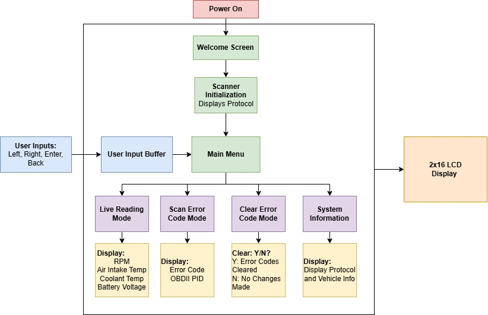

# ECE 3301 Final Project: OBDII Scanner using the PIC18F46K22 ##
## By Luca Lanzillotta and Zihong Zheng ##

### Assignment Requirements: ###
* Final Project Must Use:
    * Serial Communication: UART/I2C/SPI
    * CCP Module
    * Timer
    * Interrupt

*Abstract:*
* [*Link to original Cornell Project*](https://people.ece.cornell.edu/land/courses/ece4760/FinalProjects/s2012/ppv5/index.html)
* Create an OBD II scanner that is compatible with any ISO OBC II standard to read basic vehicle telemetry and diagnostics. The design will utilize a Sparkfun OBD II to UART intpreter board and will utilize half duplex capabilities to send requests from the PIC18F46K22 and receive data to display on an LCD. Additionally the board will include buttons to navigate a menu to send and receive specific requests such as RPM, Oil Pressure, Cylinder Diagnostics, and will have a dedicated mode to display live data on the display. 

### Components: ###
* Microcontroller: 
    * PIC18F46K22 and curiosity board (might not use if we design a PCB)
* OBC II to UART: 
    * Sparkfun OBD-II to UART board
* Display: 
    * Generic Microcontroller compatible LCD
* Buttons: 
    * 4/5 buttons in a d-pad style arrangement to emulate a controller d-pad
* Casing: 
    * 3D printed encasing to hold all the components together
* PCB: 
    * Potential to design and manufacture a little PCB that holds the pic together with its necessary connectors to communicate to the board.

# Design Notes: #
## System Block Diagram: ##

## System State Diagram: ## 

## Startup Sequence: ##

### Welcome Screen ###
* *note:* To be displayed on a 2x16 LCD Display using the PIC18F46K22    

* Write to the LCD upon startup the following string in the example below, then use TMR0 set with the proper clock frequency and calculation to create a 1 second delay
  Be sure to include the LCD.h file as well as the LCD.c file to ensure proper LCD use.

        Example:
        
        **Welcome to OBDII-PIC**
        https://github.com/LucaLanzi/OBDII_PIC
        // 1s delay

        Code Chunk:

* Detects which ISO standard is being used
    * Wait for serial 'OK' once board has detected OBDII standard
    Use an if/else statement that is constantly being checked with a flag of some kind, so we always wait for the IC to initiate until the 'ok' command is sent, we can poll for this.
    Once this poll flag has been cleared (while loop with a flag command) we can notify the user that the device has been configured.
    * Notify user "OBDII-PIC Configured"
    * SAE ISO version: xxxxxxxx
    Here we can utilized the 'AT DP' command to Display the Protocol being used, then store it, and display it in the next splash screen sequence, after which we can meet it with another 1 second delay caused by the TMR0 of the PIC.

            Example:

            OBDII-PIC Configured
            SAE ISO Ver: xxxxxxx
            // 1s delay

        Code Chunk:
    

## Standard Operation Mode: ##

* Goes to a menu where you can do the following:
* Using a D-PAD style button layout, you can move a cursor and select:
The Cursor should be flashing in the position it is in. Controls are Left, Right, Enter and Back, where each acronym is an example of the 4 modes of operation
        
        Example:

        Menu
            L.R.  S.E.C  C.E.C  S.I

### Live readings: ###
* DIsplay RPM, Air Intake temp, Coolant Temp, Battery Voltage
        
        Example: 

            Live Reading Mode:
                RPM     A.I. Temp  C. Temp   Batt. V    
                1000    xxF        xx.F    12.4V  

    Code Chunk:

### Scan Error Codes: ###
* Display OBDII PID Error Codes (User can use up and down keys to navigate through them) 
        
        Example:
            
            Error Code Mode:
                Error Code(s): xxxxxxx

    Code Chunk:
           

### Clear Error Codes: ###
* Cursor Should blink over the selection preference

        Example:

                Clear Error Code(s)? Y/N    
    
    Code Chunk:

### Get System info: (ISO Standard and Firmware version) ###
        
        Example:

            System Info Mode:
                ISO Ver: xxxxxx, Firm. V: xxxxx

    Code Chunk:

* This is entirely possible over the serial interface by sending an AT command, utilizing the ELM327 command set
Refer to pg 10. of the [ELM327 Datasheet](https://cdn.sparkfun.com/assets/learn_tutorials/8/3/ELM327DS.pdf)
* Here it states, by sending the following:
    "AT DP" over serial the IC intepreter will send the command 'Describe the current protocol' to the STN1110 and will forward that as an OBDII PID request to the vehicle
    what will be returned is a string of some type with the ISO standard desription.
    By using this we can, at the request of the user, when they navigate to the proper setting and hit enter, send the AT command over serial and display the result on the LCD

## Shut Down Operation: ##
* Just unplug the damn thing

### LCD User Interaction Configuration: ###
* The user must be able to navigate left and right on the 2x16 LCD utilizing a cursor and to be able to select a mode of operation, and exit a current mode
* The LCD.h and LCD.c header and source files respectively provide us with the functionality of a blinking cursor, allowing the user to see where their cursor position is
* By creating a command function that keeps track of where this cursor is, we can increment and decrement the position of the cursor respectively to where the user would like it to be, and by utilizing simple integer variables, we can keep track of where within the sub menus we are.

To do this we need:
* Define the Menu options (we can use an array)
* We draw the Menu, and with each user input we can determine where we are flashing the cursor along this array
* When the user hits the 'enter' button, we set which value of the menu we want to excecute, triggering something like a switch case to display the menu we would like to enter
* If we are in a sub menu, we can use the 'back' button to trigger us out of the switch case and go back to the main screen.

    Code Chunk: 

### OBDII-UART ###

* The UART to OBD-II board uses the following 2 chips:
    * STN1110 for OBD-II, and MCP2551 for CAN
The STN1110 is what we will be interfacing with in order to pull OBDII codes from the car, these are commands that we can extract via the following:
* The DB9 to OBDII supplies power and serial interfacing from the car to the board, the microcontroller must be wired seperately
* The OBDII to UART board uses Tx, Rx, and GND which go to the PIC
* One incredibly important aspect about the OBDII to UART board is that it automatically detects which OBDII protocol to use when it initializes with your car
* When the car is set to the first position and the OBDII connector is hooked up, the car tells the device what ISO standard it is using, and the device automatically configures itself.
* The existing documentation uses an FTDI board, which is a serial to USB interface device, the documentation utilizes:
    * BAUD: 9600 bps
    * Data bits: 8
    * Stop bits: 1
    * Parity bits: no parity
        My Assumption is that this UART configuration can be set for the PIC18F46K22 and can therefore read and write to the serial buffer of the STN1110.
        Making it easy to send and recieve commands, essentially we just need to establish a way to send and recieve information using the AT protocol, and then display it on an LCD
* The PIC must send AT commands, a type of syntax/protocol for the STN1110/ELM327DSI to recieve commands from devices, the list of commands are available [here](https://cdn.sparkfun.com/assets/learn_tutorials/8/3/ELM327DS.pdf)

    Code Chunk:
    
### Reference Documents and Useful Links: ###

# OBDII-UART Documentation: #
* [Original Project Documentation - OBDII Data Logger Cornell University Project](https://people.ece.cornell.edu/land/courses/ece4760/FinalProjects/s2012/ppv5/index.html)
* [Sparkfun OBD-II to UART board](https://www.sparkfun.com/sparkfun-obd-ii-uart.html)
* [Sparkfun OBD-II to UART board schematic](https://cdn.sparkfun.com/assets/2/4/d/c/d/520ab4c5757b7f5e0acc8c0e.pdf)
* [Sparkfun OBD-II to UART Implementation Guide](https://learn.sparkfun.com/tutorials/obd-ii-uart-hookup-guide/all)
* [OBD Protocol Information](https://en.wikipedia.org/wiki/On-board_diagnostics#Standard_interfaces)
* [OBD PID Information](https://en.wikipedia.org/wiki/OBD-II_PIDs)
* [Display Hookup Guide](https://learn.sparkfun.com/tutorials/basic-character-lcd-hookup-guide)
* [Github Syntax and Formatting](https://docs.github.com/en/get-started/writing-on-github/getting-started-with-writing-and-formatting-on-github/basic-writing-and-formatting-syntax)

# PIC18F46K22 UART Documentation: #
* [PIC18F46K22 Datasheet](https://ww1.microchip.com/downloads/en/DeviceDoc/PIC18(L)F2X-4XK22-Data-Sheet-40001412H.pdf) (Page 259)
